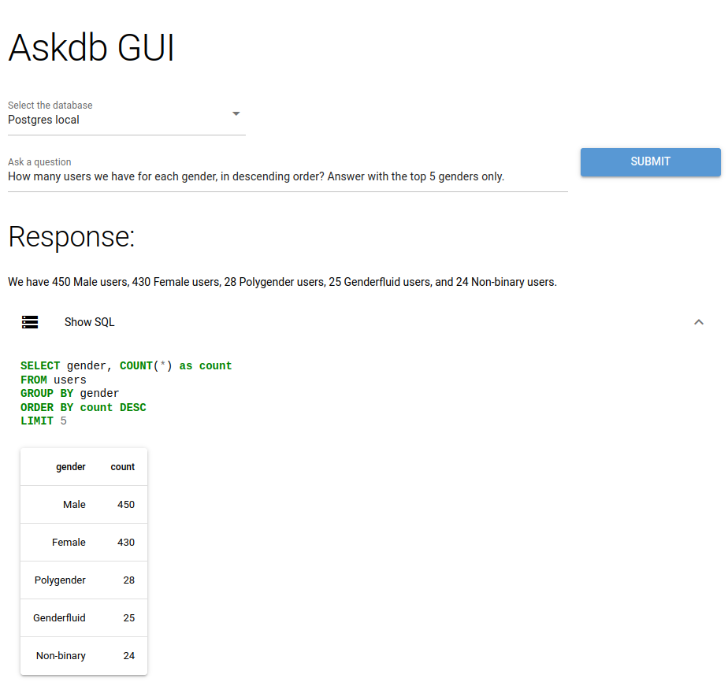
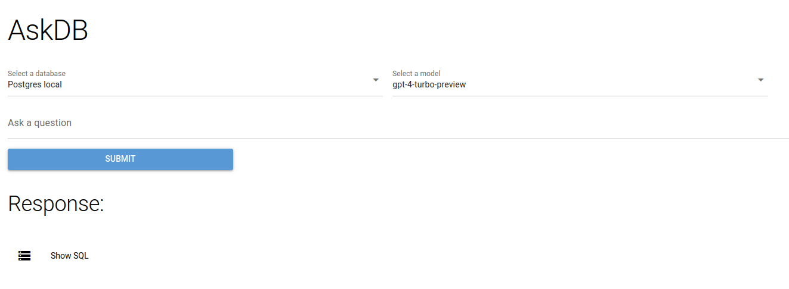
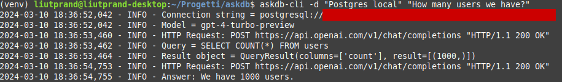

# AskDB

Universal tool for extracting informations from databases using a Large Language Model



## Project overview

AskDB is a Q&A database tool that allows to ask questions to your relational data in natural language and get answers, powered by GPT-4 Turbo.

In very brief, what it does is:

- Connect to the database of choice
- Extract the metadata (tables schemas and example rows)
- Prompt the LLM with the metadata togheter with the desired question
- The LLM responds with the corresponding SQL query
- The query is executed
- The LLM is called a second time, converting the result set in a natural language answer

For now, supported databases are: **PostgreSQL, MySql, Sqlite**. AskDB, however, is designed to be easly extended to new databases (including data wharehouse platforms such as BigQuery) and will be in the future.

**Keep in mind that this is a project in its very early stages and for sure many features are missing.**

## Tech

AskDB is written in Python. The design philosophy is to keep things simple and to create from scratch, avoiding frameworks such as LangChain (powerful but bloated and in my opinion full of questionable abstractions). Thus, this project is built on top of just a few libraries:

- [SqlAlchemy](https://www.sqlalchemy.org/) for database handling
- [NiceGUI](https://nicegui.io/) for the web based graphical interface
- [Click](https://click.palletsprojects.com) for the CLI

And a couple of others.

## Installation

You need Python (>= 3.10), Pip and Git installed on your system.

Installation is very straightforward:

```
pip install -U pip
pip install git+https://github.com/marcolardera/askdb
```

## Configuration

Before using Askdb, you need to configure the connections to your databases. In order to do so follow these steps:

- Create a `askdb` folder inside your configuration folder as defined by the [XDG Base Directory Specification](https://specifications.freedesktop.org/basedir-spec/basedir-spec-latest.html). On Linux/MacOS, by default, it is the `~/.config` folder but can be changed using the `XDG_CONFIG_HOME` environment variable. On Windows it should be `C:/Users/<USERNAME>/.config`.
- Create a `connections.json` file inside that folder. The full path should be something like `~/.config/askdb/connections.json` or `C:/Users/<USERNAME>/.config/askdb/connections.json`
- Fill the file with connections informations as defined below

[Example](connections_template.json) of `connections.json`:

```
[
    {
        "name": "Postgres",
        "connection_string": "postgresql://<USER>:<PASSWORD>@<HOST>:<PORT>/database"
    },
    {
        "name": "MySql",
        "connection_string": "mysql://<USER>:<PASSWORD>@<HOST>:<PORT>/database"
    },
    {
        "name": "Sqlite",
        "connection_string": "sqlite:////path/to/my/database.db"
    }
]
```

The `name` field is just the id of the connection, you can put whatever you want in it. The `connection_string` field follows the standard db connection string convention. In general, if the string is valid for SqlAlchemy, then it is valid for AskDB. You can have as many connections as you want inside this file.

Keep in mind that the supported (and tested) databases are PostgreSQL, MySql and Sqlite but the tool shoud work even with other DBMS supported by SqlAlchemy, with the only difference being that in this case it would use a [generic prompt](src/prompts/general.txt) instead of a customised one.

Once the connections have been configured, one final step remains. Since AskDB uses GPT-4 Turbo, an Openai API Key (with [GPT-4 access](https://help.openai.com/en/articles/7102672-how-can-i-access-gpt-4)) must be provided. To do so, simply set the environment variable `OPENAI_API_KEY`.

## Safety and privacy

**THIS IS VERY IMPORTANT:** Letting a LLM create a query and executing it without human validation may be dangerous for your data. What if the model hallucinates a INSERT/UPDATE/DELETE statement instead of a SELECT? The probability of this happening is low but not zero. **In order to avoid this risk remember to always create users with SELECT privileges only to use for this tool.**

Also keep in mind the privacy implications of sending database schemas and examples of data to a remote LLM. Always check regulations, policies, etc.

## Usage

### GUI

In order to run AskDB just type:

`askdb`

The web interface will open in the browser.



The use should be self-evident: simply select the database to be queried (defined in the `connections.json` file) from the list, enter the query and press 'Submit'. After a while you will get the answer. By clicking on "Show SQL" you can view the SQL query generated by the LLM and a table with the results.

### CLI

There is also a command-line interface, designed primarily for testing purposes, which can be invoked with the command `askdb-cli`. The syntax is the following:

```
Usage: askdb-cli [OPTIONS] QUESTION

Options:
  -d, --database TEXT  Name of the database (from connections.json)
  --help               Show this message and exit.
```

For example:

`askdb-cli -d "Postgres local" "How many users we have?"`



If the database option (`-d`) is omitted it will use, by default, the first entry in the `connections.json` file.